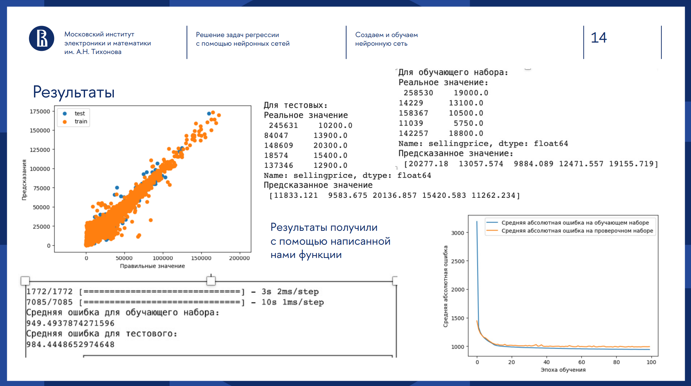
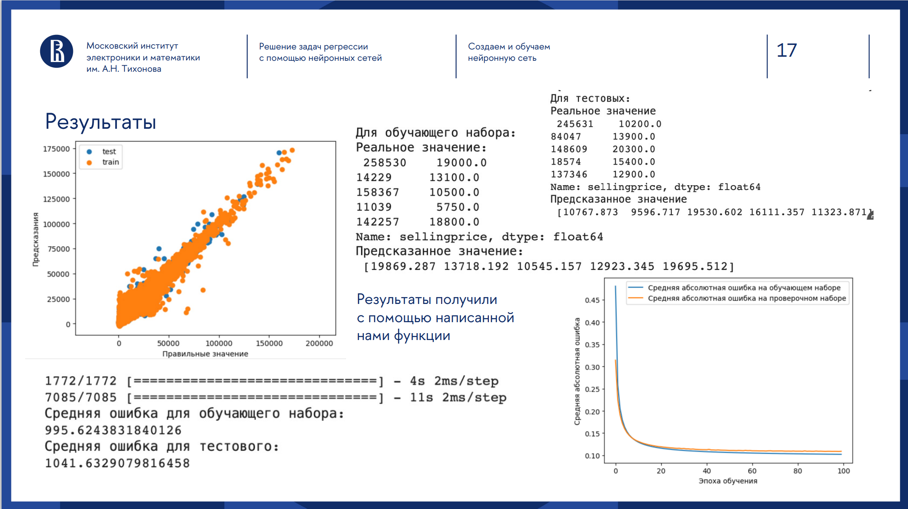
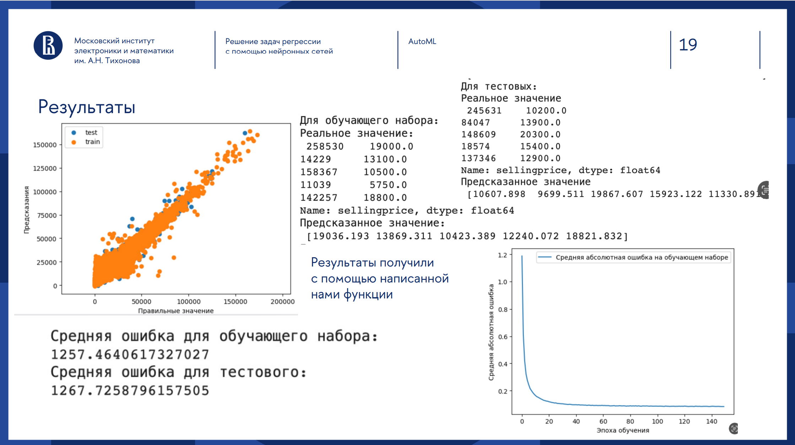
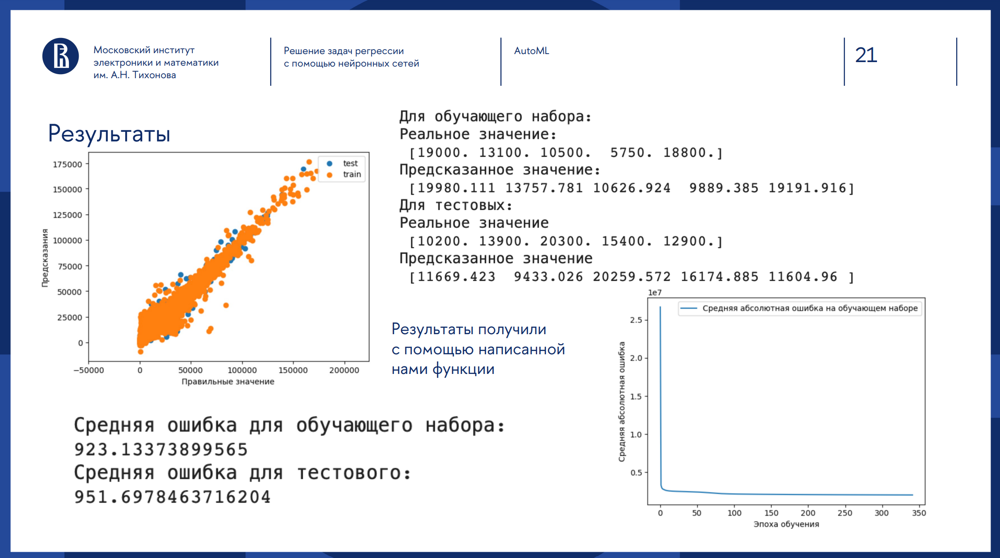

# 🚗 Предсказание стоимости автомобилей

Проект на Python для предсказания рыночной цены автомобилей на основе их характеристик с использованием методов машинного обучения.

  
  
  
  

---

## 📌 Описание проекта

В этом проекте мы:

1. Собираем и очищаем датасет автомобилей (марка, модель, год, пробег, двигатель, коробка передач и др.).  
2. Проводим разведочный анализ данных (EDA) и визуализируем ключевые зависимости.  
3. Обучаем несколько регрессионных моделей (линейная регрессия, случайный лес, градиентный бустинг).  
4. Подбираем гиперпараметры с помощью `GridSearchCV`.  
5. Оцениваем модели метриками MAE, RMSE и R².  
6. Сохраняем лучшую модель для дальнейшего использования.

---

## 🛠️ Технологии

- Python 3.8+  
- pandas, numpy  
- scikit-learn  
- matplotlib, seaborn  
- Jupyter Notebook  

---

